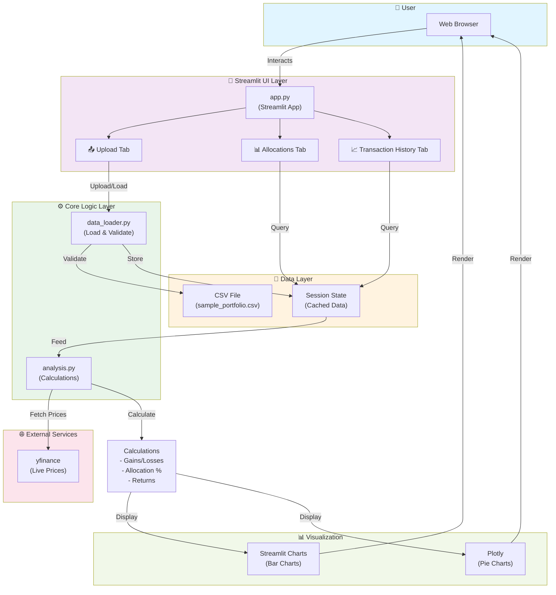
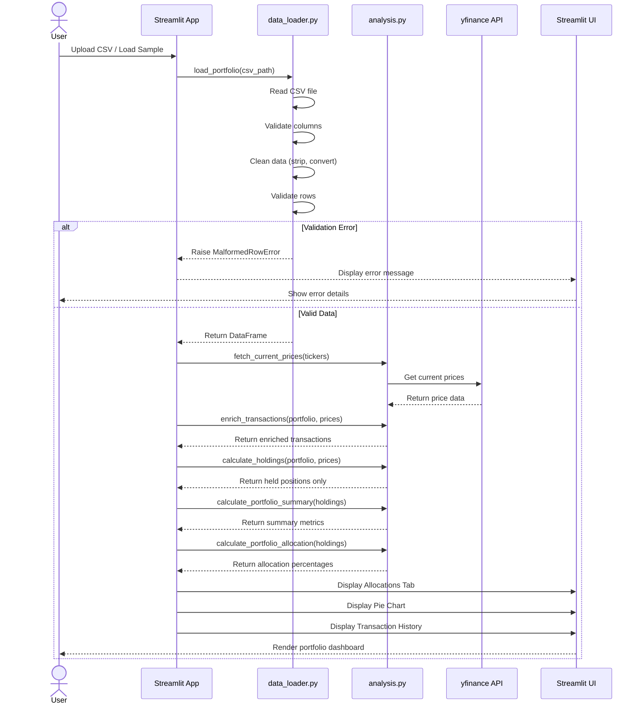

# Portfolio Analyzer

A comprehensive Streamlit-based portfolio analysis application that tracks stock holdings, calculates returns, and visualizes portfolio performance.

## Features

### 📊 Multi-Tab Interface
- **Upload Tab** — Load portfolio data from CSV or sample data
- **Allocations Tab** — View current holdings, allocation percentages, and interactive pie chart
- **Transaction History Tab** — Track buy/sell transactions with date filtering and realized gains calculation

### 💰 Core Calculations
- **Current Value** — Live stock prices via yfinance
- **Unrealized Gains** — Profit/loss on held positions
- **Realized Gains** — Profit/loss on sold positions
- **Portfolio Allocation** — Weight distribution by ticker
- **Total Return** — Overall portfolio performance percentage

### 📈 Visualizations
- Bar chart of allocation by ticker
- Interactive Plotly pie chart showing portfolio composition
- Detailed data tables with formatting

### ✅ Data Validation
- Comprehensive error handling for malformed CSV data
- Automatic data cleaning (whitespace trimming, type conversion)
- Validation of buy/sell transaction consistency
- Clear error messages with row numbers

## Installation

### Prerequisites
- Python 3.8+
- pip

### Setup

1. **Clone/navigate to the project:**
```bash
cd week1-portfolio-analyzer
```

2. **Create and activate virtual environment:**
```bash
python -m venv venv
source venv/bin/activate  # On Windows: venv\Scripts\activate
```

3. **Install dependencies:**
```bash
pip install -r requirements.txt
```

## Running the App

```bash
source venv/bin/activate
streamlit run app.py
```

The app will open in your browser at `http://localhost:8501`

## System Architecture



## Project Structure

```
week1-portfolio-analyzer/
├── app.py                    # Main Streamlit application
├── requirements.txt          # Python dependencies
├── README.md                 # This file
├── ERROR_HANDLING.md         # Error handling documentation
├── data/
│   └── sample_portfolio.csv  # Sample portfolio data
├── src/
│   ├── __init__.py
│   ├── data_loader.py        # CSV loading and validation
│   └── analysis.py           # Financial calculations
└── tests/
    ├── __init__.py
    ├── test_analysis.py      # Analysis function tests (31 tests)
    └── test_data_loader.py   # Data loader tests (26 tests)
```

## Usage Guide

### Tab 1: Upload

**Load Your Portfolio:**

1. **Option A - Upload CSV File:**
   - Click "Choose a CSV file"
   - Select your portfolio CSV with columns: `ticker`, `shares`, `purchase_price`, `purchase_date`, `sold_price`, `sold_date`
   - App validates and loads data automatically

2. **Option B - Load Sample Data:**
   - Click "Load Sample Data" button
   - Pre-loaded example portfolio appears

**CSV Format Requirements:**
```csv
ticker,shares,purchase_price,purchase_date,sold_price,sold_date
AAPL,10,150.00,2023-01-15,,
MSFT,5,280.00,2023-02-20,350.00,2024-06-15
GOOGL,8,95.00,2023-03-10,,
```

- **ticker**: Stock symbol (e.g., AAPL, MSFT) — **Required**
- **shares**: Number of shares — **Required**, must be positive
- **purchase_price**: Price per share at purchase — **Required**, must be positive
- **purchase_date**: Date of purchase (YYYY-MM-DD format) — **Required**
- **sold_price**: Sale price per share (optional, leave empty if still holding)
- **sold_date**: Date of sale (optional, only if sold_price provided)

### Tab 2: Allocations

**View Current Holdings:**

- **Metrics Row:** Shows total invested, current value, total gain/loss with percentage return
- **Holdings Summary Table:** Displays each held position with:
  - Ticker and share count
  - Purchase and current prices
  - Purchase and current values
  - Unrealized gain/loss ($)
  - Return percentage

- **Allocation Visualization:**
  - Interactive bar chart showing allocation percentages
  - Plotly pie chart with hover details
  - Allocation details table sorted by value

### Tab 3: Transaction History

**Filter and Analyze Transactions:**

1. **Select Date Range:**
   - Choose start and end dates
   - Only transactions within range are displayed

2. **View Metrics:**
   - Amount Invested (buy transactions in period)
   - Realized Gains (profit from sold positions in period)
   - Transaction count
   - Unique tickers

3. **Analyze Transactions:**
   - Full transaction table sorted by date
   - Shows buy/sell type for each transaction
   - Sale prices and return percentages for sold positions
   - Per-ticker breakdown with buy/sell counts

## Data Calculations

### Unrealized Gain/Loss (Held Positions)
```
Unrealized Gain = (Current Price × Shares) - (Purchase Price × Shares)
Unrealized Return % = (Unrealized Gain / Investment) × 100
```

### Realized Gain/Loss (Sold Positions)
```
Realized Gain = (Sale Price × Shares) - (Purchase Price × Shares)
Realized Return % = (Realized Gain / Investment) × 100
```

### Portfolio Allocation
```
Allocation % = (Position Value / Total Portfolio Value) × 100
```

### Total Return
```
Total Return % = (Total Gain / Total Invested) × 100
```

## Testing

### Run All Tests
```bash
pytest tests/ -v
```

### Run Specific Test Suite
```bash
# Analysis tests (31 tests)
pytest tests/test_analysis.py -v

# Data loader tests (26 tests)
pytest tests/test_data_loader.py -v
```

### Test Coverage
```bash
pytest tests/ --cov=src --cov-report=term-missing
```

**Current Status:** 57 tests, 100% passing ✅

### Test Categories

**Analysis Tests:**
- Transaction enrichment and gain calculations
- Holdings calculations for held positions
- Portfolio allocation percentages
- Portfolio summary metrics
- Realized gains filtering by date range
- Edge cases (all losses, single holding, fractional shares)

**Data Loader Tests:**
- Valid CSV loading and cleaning
- Column validation
- Missing value detection
- Data type conversion
- Negative value detection
- Buy/sell transaction consistency
- File handling errors
- Multiple concurrent errors

## Error Handling

The application includes comprehensive error handling for:

### Missing Data
- Missing required columns
- Missing values in critical fields
- Empty CSV files

### Invalid Data
- Non-numeric shares or prices
- Invalid date formats
- Negative prices/shares
- Whitespace-only values

### Transaction Validation
- Sold transactions missing sale dates/prices
- Sale dates before purchase dates
- Inconsistent buy/sell data

### Clear Error Messages
All validation errors include:
- Row number (for CSV errors)
- Field name
- Expected vs. actual value
- Clear description of the issue

See [ERROR_HANDLING.md](ERROR_HANDLING.md) for detailed error reference.

## Sample Data

The project includes sample_portfolio.csv with:

| Ticker | Shares | Purchase Price | Purchase Date | Status |
|--------|--------|-----------------|---------------|--------|
| AAPL   | 10     | $150.00         | 2023-01-15    | Held   |
| MSFT   | 5      | $280.00         | 2023-02-20    | Sold   |
| GOOGL  | 8      | $95.00          | 2023-03-10    | Held   |
| AAPL   | 5      | $165.00         | 2023-06-01    | Sold   |
| ORCL   | 20     | $120.00         | 2023-04-05    | Sold   |
| ORCL   | 40     | $145.00         | 2023-05-15    | Held   |
| NVDA   | 15     | $85.00          | 2023-07-10    | Held   |

## Dependencies

Key packages:
- **streamlit** (1.61.1) — Web UI framework
- **pandas** (3.0.5) — Data manipulation
- **yfinance** (0.2.43) — Live stock prices
- **plotly** (5.24.1) — Interactive charts
- **pytest** (9.1.1) — Testing framework

Full list in [requirements.txt](requirements.txt)

## Performance Notes

- Live price fetching (yfinance) may take 5-10 seconds for multiple tickers
- The app caches results in session state to avoid refetching when switching tabs
- First load requires internet connection to fetch current stock prices

## Troubleshooting

### "Module not found" error
```bash
source venv/bin/activate  # Activate virtual environment
pip install -r requirements.txt  # Reinstall dependencies
```

### Stock prices not updating
- Check internet connection
- Verify ticker symbols are valid (NASDAQ/NYSE listed)
- Try refreshing the browser or reloading the app

### CSV validation errors
- Check [CSV Format Requirements](#csv-format-requirements) section
- Review [ERROR_HANDLING.md](ERROR_HANDLING.md) for specific error messages
- Ensure dates are in YYYY-MM-DD format

### Port already in use
```bash
streamlit run app.py --server.port 8502
```

## Data Flow Diagram



## Architecture

### src/data_loader.py
- CSV file loading and validation
- Data type conversion
- Whitespace cleaning
- Comprehensive error handling

### src/analysis.py
- Transaction enrichment (buy/sell classification)
- Unrealized gain calculations
- Realized gain calculations
- Portfolio allocation calculations
- Summary statistics

### app.py
- Streamlit UI with three tabs
- Session state management
- User input handling
- Data visualization

## Future Enhancements

Potential improvements:
- Cost basis tracking (FIFO, LIFO, average cost)
- Historical price tracking
- Tax loss harvesting suggestions
- Dividend tracking
- Multi-account support
- Export portfolio to PDF
- Performance benchmarking

## License

This project is part of the Gen Academy Agentic AI course.

## Support

For issues or questions:
1. Check [ERROR_HANDLING.md](ERROR_HANDLING.md)
2. Review test cases in `tests/` for usage examples
3. Check Streamlit documentation: https://docs.streamlit.io

---

**Last Updated:** August 2026
**Version:** 1.0
